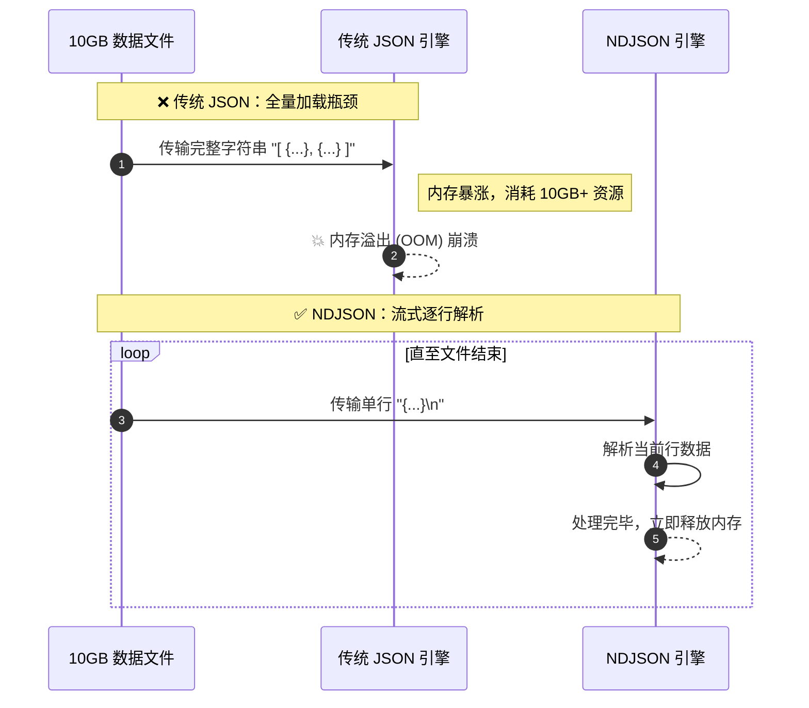

JSON（JavaScript Object Notation）和 NDJSON（Newline Delimited JSON / JSON Lines）是现代 Web 和数据工程中最重要的数据交换格式。以下是它们的发展历史和技术演进。

## 一、 JSON 的发展历史

JSON 并不是被“发明”出来的，而是被“发现”的。它的语法本来就是 JavaScript 语言的一部分。

### 1. 诞生背景（1990年代末 - 2001年）

在 2000 年代初，Web 开发中进行前后端数据交换的绝对霸主是 XML（如 SOAP，以及后来在 2005 年被命名的 AJAX，AJAX 中的 "X" 就是指 XML）。但 XML 存在一些明显的问题：标签繁琐、体积大、解析复杂且消耗内存。

当时在 State Software 工作的 Douglas Crockford 与 Chip Morningstar（Crockford 后来在 2005 年加入了雅虎）想要寻找一种更轻量的方式来实现浏览器与服务器的双向通信。他们注意到 JavaScript（具体是 1999 年 12 月发布的 ECMA-262 第三版）中的对象字面量（Object literals）和数组字面量非常简洁，可以直接被解析。于是，在 2001 年，Crockford 首次提出并命名了 JSON。

> 早期，为了在网页中读取 JSON，开发者常直接使用 JavaScript 的 `eval()` 函数。由于大括号 `{}` 可能会被 JS 引擎误解析为代码块（Block）而非对象，因此历史上标准的写法是加上小括号：`eval('(' + jsonString + ')')`。后来为了防范执行恶意代码的 XSS 风险，才在 ES5（2009年）中正式引入了原生的 `JSON.parse()`。

### 2. 正式崛起与标准化（2001 - 2013年）

- **2001-2002年**：Douglas Crockford 在 2001 年首次提出并命名了 JSON，并在 2002 年正式上线了首个 JSON 官网 JSON.org。他用极其简洁的铁路图（语法图）描述了 JSON 的所有规则。由于其出色的跨语言特性，几乎所有主流语言都很快社区自发实现了 JSON 解析库。
- **2005-2006年**：随着 Web 2.0 和 RESTful API 的兴起，开发者迅速抛弃了笨重的 XML。2006 年 7 月，JSON 迎来了它的第一个官方标准：RFC 4627，正式注册了 `application/json` 这个 MIME 媒体类型。
- **2013-2017年**：JSON 在 2013 年正式被欧洲计算机制造商协会（ECMA）收录为标准（ECMA-404）。随后 IETF 也发布了更新的规范（如 2014 年的 RFC 7159 和 2017 年的 RFC 8259，最终确立为互联网标准 STD 90）。

### 3. JSON 的成功原因

JSON 极其精简，它的语法规则不到一页纸，且设计之初就宣称“JSON 语法永远不会改变”。这种绝对的稳定性、高可读性以及与编程语言自带的数据结构（字典/哈希表、数组）完美映射的特点，让它成为了当今互联网数据传输的事实标准。

## 二、 NDJSON（JSON Lines / JSONL）的诞生与发展

随着 JSON 成为主流，开发者在处理大规模数据时遇到了一个致命的瓶颈。

### 1. 传统 JSON 的痛点

在传统的 JSON 中，如果要传输多条记录，必须把它们放在一个大数组里：

```json
[
  {"id": 1, "name": "Alice"},
  {"id": 2, "name": "Bob"}
]
```

问题在于流式处理（Streaming）：标准的 JSON 解析器通常需要将整个文件或完整的字符串加载到内存中才能解析。如果这是一个 10GB 的日志文件，机器的内存很快就会被撑爆。为了流式解析标准 JSON，开发者必须使用极其复杂的事件驱动解析器（如 SAX 风格解析）。

### 2. NDJSON 的出现（2010 - 2012年）

大约在 2010 年到 2011 年左右，不同的开发者和社区为了解决“如何高效流式处理海量 JSON”的问题，不约而同地发明了同一种极其简单的格式：每一行是一个合法的 JSON 对象，行与行之间用换行符（`\n`）分隔。

这被称为 **NDJSON** (Newline Delimited JSON)，也叫 **JSON Lines** (JSONL) 或 **LDJSON** (Line-delimited JSON)。



```json
{"id": 1, "name": "Alice"}
{"id": 2, "name": "Bob"}
```

*(注意：最外层没有中括号 `[]`，对象之间也没有逗号 `,`)*

### 3. 为什么 NDJSON 如此受欢迎？

- **极简的解析**：程序只需要逐行读取文本（这是所有编程语言中最基础、内存占用最小的 I/O 操作），读到一行字符串后，对这一行执行标准的 `JSON.parse()` 即可。
- **天然的流式传输与追加**：向文件中追加新数据时，只需要在文件末尾追加新的一行即可（传统 JSON 数组则需要去掉结尾的 `]`，加上 `,`，再加上新对象，最后补上 `]`，非常麻烦）。
- **并行处理**：在 Hadoop、Spark 等大数据框架中，可以轻松地将一个大的 NDJSON 文件切分成多个数据块（因为通过换行符可以安全、精确地定位记录边界，不会像解析传统大 JSON 数组那样发生截断错误），分发给多台机器并行解析。

### 4. 标准化与现状（2013年至今）

- **2013-2014年**：社区开始为其建立非正式标准。2013年 jsonlines.org 网站上线，规范了格式要求（必须使用 UTF-8，每行必须是合法的值等）。2014 年 10 月，NDJSON 规范 1.0.0 发布。
- **文件扩展名**：通常使用 `.jsonl` 或 `.ndjson`。
- **核心应用场景**：今天，NDJSON 已经成为大数据流处理、日志收集（如 Fluentd, Elasticsearch）、大模型训练数据集（Hugging Face 数据集）、以及流式 API（如 OpenAI 的流式输出）的标准格式。

## 总结

JSON 终结了 XML 在前端和后端的统治，以极简主义统一了结构化数据交换。

NDJSON (JSONL) 则是对 JSON 完美的补充，它打破了 JSON 在“流式处理”和“大数据”场景下的内存限制，通过增加一个简单的“换行符”规则，让 JSON 具备了处理无限量数据的能力。
