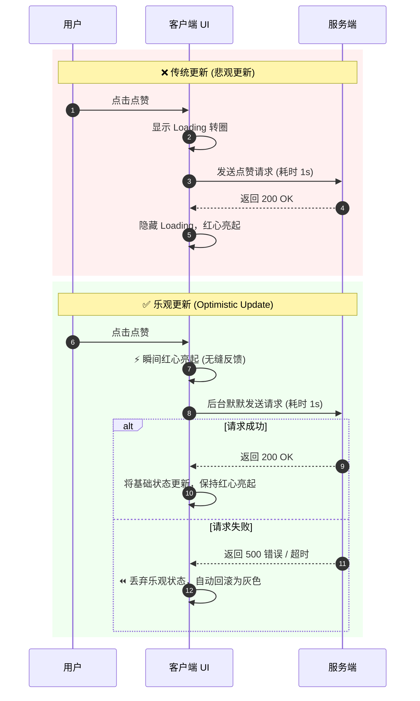

你是否有过这样的体验：在地铁里刷微博或 Twitter，网络信号极差。当你看到一篇很有趣的内容，点击了“点赞”按钮——神奇的是，那颗心瞬间就红了，丝毫没有卡顿感。

但如果你仔细观察，可能会发现在几秒钟后，那颗红心突然又变回了灰色，并弹出一个微弱的提示：“网络不佳，点赞失败”。

这背后隐藏着现代前端开发和用户体验设计中一个非常经典的策略：**乐观更新 (Optimistic Update)**，有时也被称为**乐观 UI (Optimistic UI)**。

## 什么是“乐观更新”？

在传统的 Web 开发模式中，当用户触发一个交互（比如点赞、提交评论、勾选待办事项），标准的流程是这样的：

1. 用户点击按钮。
2. 界面出现 Loading 动画（转圈圈/菊花图），按钮被禁用。
3. 客户端向服务器发送网络请求。
4. 等待几百毫秒甚至几秒后，服务器返回“成功”。
5. 客户端取消 Loading 动画，更新界面（比如让红心亮起）。

这种模式很安全，但在网络波动或服务器响应慢时，会让应用显得极其**迟钝和卡顿**。

**乐观更新 (Optimistic Update)** 打破了这个常规。它的核心思想是：**不等待服务器的响应，“乐观地”假设请求一定会成功，并在用户交互的瞬间立即更新客户端的用户界面 (UI)。**

如果稍后服务器确实返回了成功，UI 保持现状，一切完美；如果服务器不幸报错（比如断网了），客户端则会将 UI **“回滚 (Rollback)”** 到用户操作之前的状态，并给出一个友好的错误提示。

我们可以通过下面的时序图直观地对比这两种模式：



## 它的工作原理是怎样的？

乐观更新的工作流就像是一场精心编排的魔术，分为四步：

1. **瞬间响应 (Instant UI Update)**：用户点击点赞按钮，状态立即改变。用户大脑感知到的延迟是 `0ms`。
2. **暗中工作 (Background Request)**：在用户看不到的后台，客户端默默地向服务器发送真实的 API 请求。
3. **成功确认 (Success Case)**：如果服务器返回成功，客户端只需在底层将“基础状态”更新，乐观状态会自动与之同步，UI 保持最新结果。
4. **失败回滚 (Error & Rollback)**：如果服务器返回错误，底层状态不改变。框架会自动丢弃刚才的“乐观预测”，让 UI 无缝回退到修改前，并可能弹出一个 Toast 提示：“操作失败，请稍后再试”。

## 代码是如何实现的？(以 React 19 为例)

随着框架的演进，实现乐观更新变得越来越简单。在 React 19 中，官方直接内置了 `useOptimistic` Hook 来处理这种场景：

```tsx
import { useState, useOptimistic, startTransition } from 'react';

function LikeButton({ initialLikes }) {
  // 定义真实状态
  const [likes, setLikes] = useState(initialLikes);
  // 定义乐观状态：useOptimistic 接收真实的 state 作为基础值
  const [optimisticLikes, addOptimisticLike] = useOptimistic(
    likes,
    (currentLikes, amount) => currentLikes + amount
  );

  const handleLike = () => {
    // 1. 在 React 19 中，startTransition 支持异步函数
    // 只有在 Transition/Action 内部的异步操作才能保持乐观状态
    startTransition(async () => {
      // 2. 触发乐观更新：UI 瞬间 +1
      addOptimisticLike(1); 
      
      try {
        // 3. 发送真实的后台请求
        await serverLikeAPI();
        // 4. 成功后更新真实状态，useOptimistic 会自动同步
        setLikes((prev) => prev + 1);
      } catch (error) {
        // 5. 失败报错。不需要手动回滚！
        // 只要异步函数执行结束时或抛出异常时，真实状态没有变，
        // React 就会自动抛弃乐观更新，回退到原来的 likes
        console.error("点赞失败", error);
      }
    });
  };

  return (
    <button onClick={handleLike}>
      点赞数：{optimisticLikes}
    </button>
  );
}
```

这段代码完美展示了乐观更新的艺术：UI 绑定的是 `optimisticLikes`。在 React 19 中，当 `addOptimisticLike` 被包含在 Transition (或 form action) 中调用时，它会立刻更新 `optimisticLikes`。如果随后的异步请求抛出异常，或者状态没有发生实质性变更，React 会自动放弃这个乐观状态，重新使用基础状态 `likes`。不需要写复杂的 rollback 回滚逻辑！

除此之外，SWR 和 TanStack Query (React Query) 等数据请求库也内置了强大的 `onMutate` 乐观更新支持。

## 适用场景与“雷区”

虽然乐观更新能带来极致的丝滑体验，但它并不是银弹。

**✅ 什么时候该用（推荐）：**
* **成功率极高的操作**：比如点赞、收藏、关注、给文章打标签。
* **非破坏性操作**：比如将待办事项标记为完成、修改个人昵称、拖拽列表排序。
* **对实时性要求极高的交互**：比如聊天应用发消息、白板工具画线。

**❌ 什么时候绝对不能用（雷区）：**
* **涉及资金与交易**：比如支付订单、银行转账。你绝对不能“乐观地”先告诉用户支付成功，然后几秒后告诉他“抱歉扣款失败”，这会引发严重的信任危机。
* **不可逆的破坏性操作**：比如删除重要文件、注销账号。必须等待服务器确认后，再从界面上移除。
* **强依赖服务端计算逻辑的操作**：比如提交表单后，需要服务器生成一个唯一的订单号展示给用户。这时候客户端是无法“乐观预测”出这个订单号的，或者需要复杂的服务器验证逻辑（比如用户名是否已被占用）。

## 跨学科的艺术

如果你跳出纯写代码的视角，“乐观更新”其实是一个极其有趣的跨学科概念：

1. **在前端工程视角**：它是复杂的状态管理。开发者需要巧妙地分离“本地乐观状态”和“服务端真实状态”。
2. **在 UX 设计视角**：它是对人类心理学的应用。通过消除等待的焦虑感，欺骗用户的视觉感知，让应用显得比实际更快，这就是所谓的提升“感知性能 (Perceived Performance)”。
3. **在分布式系统视角**：它是“最终一致性 (Eventual Consistency)”和“网络延迟补偿”在客户端的微观体现。允许短时间内的数据不一致，换取极高的可用性和流畅度。

## 结语

最好的设计，往往是用户察觉不到的设计。

下一次，当你在某个 App 里点下一个瞬间亮起的赞时，不妨在心里为背后的开发团队默默点个赞——他们为了让你这半秒钟的顺畅体验，在代码的底层写下了一整套优雅的“乐观”与“回滚”逻辑。

构建伟大产品的秘密，往往就藏在这些微小的细节里。
